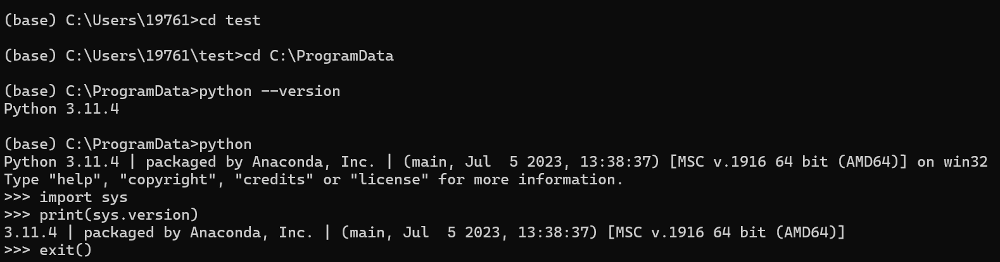
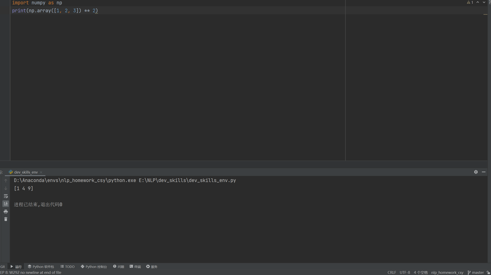

# 派大星的自我介绍


你好，我是**派大星**，我是这个动画片的男二号。以下是我的自我介绍：

---

## 基础档案

### 外貌特征
- 五角星

### 我的朋友
1.珊迪

### 重要坐标
- **住址**：[贝壳街120号]

### 日常作息
- 随机安排

### 人生信条
> "及时享乐"

## 我的专业是人工智能
### 我最喜欢的一段代码

```python
import numpy as np
print(np.array([1, 2, 3]) ** 2)
```
### 我最喜欢的工具是pycharm


### 我可以在IDE上便捷管理编译器和环境
