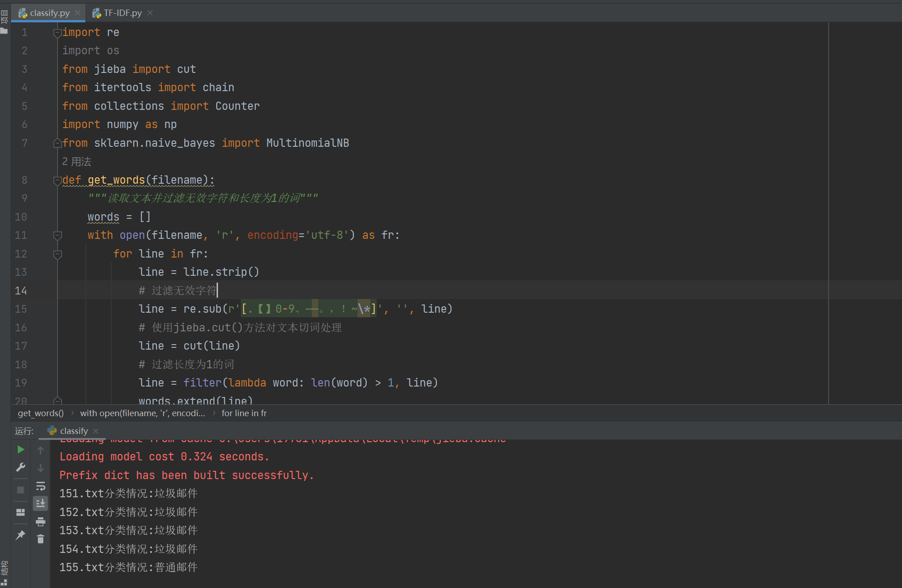
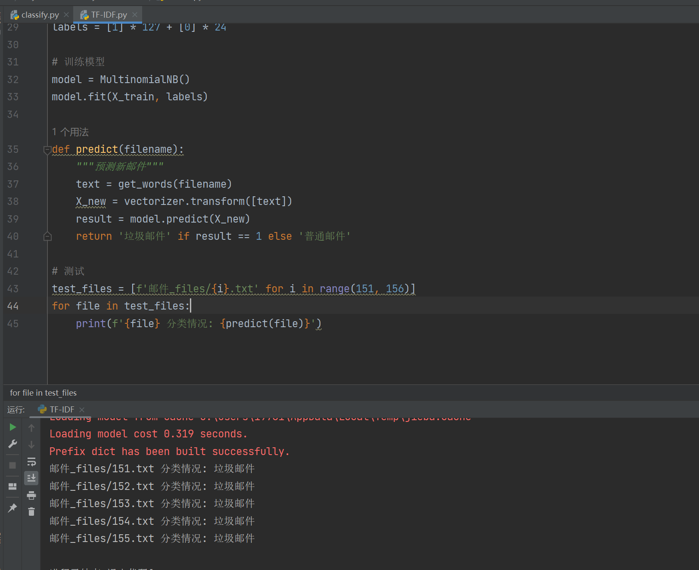
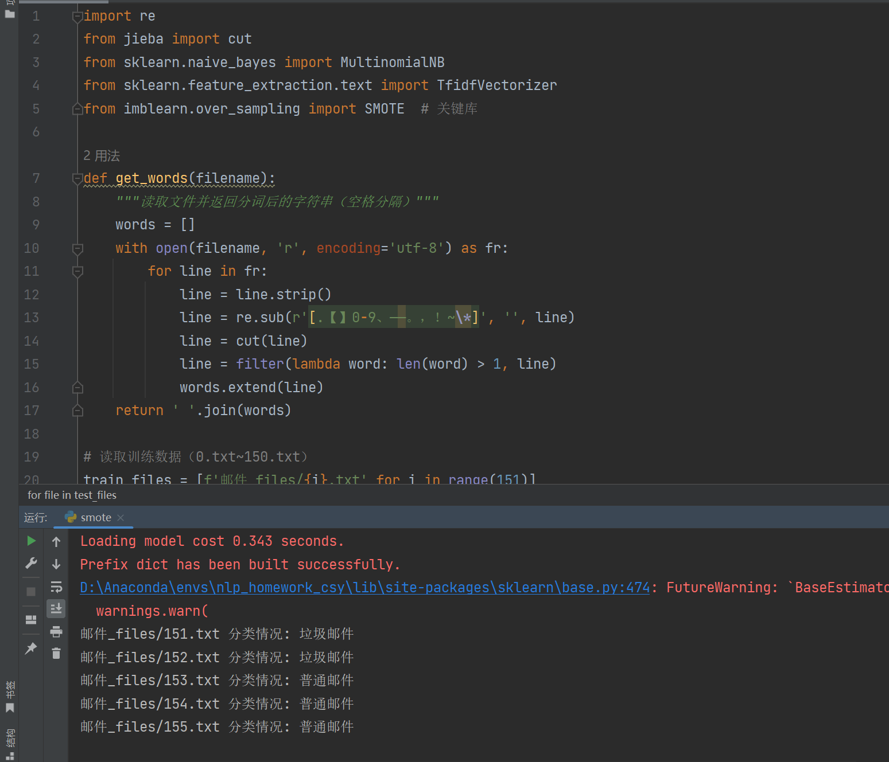
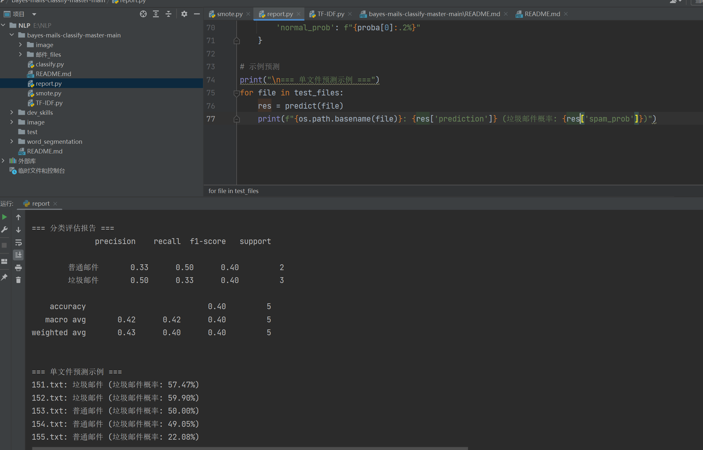

# 本仓库分别采用高频词特征、TF-IDF加权特征、样本平衡处理、增加模型评估指标进行对邮件的预测

## 代码核心功能说明:
- 算法基础：采用多项式朴素贝叶斯分类器,通过独立性假设简化联合概率计算，结合贝叶斯定理将邮件分类问题转化为概率比较问题
- 数据处理流程：使用 jieba 库进行中文分词，具体见代码中  get_words（）函数
- 特征构建过程：1.高频词特征选择：统计训练集中出现频率最高的前 N 个词，构建词频向量。 2.TF-IDF特征加权：计算词频（TF）和逆文档频率（IDF）   
   
样本平衡处理和增加模型评估指标实现方式分别在smote.py和report.py

## 高频词特征运行截图如下：

## TF-IDF运行截图如下：

## 样本平衡处理运行截图如下：

## 增加模型评估指标运行截图如下：
